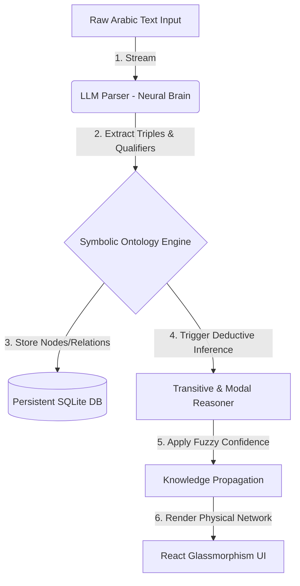

<p align="center">
  
</p>

<h1 align="center">🪐 LEGEND: Logical Entity Graph & Evolutionary Neuro-Symbolic Database</h1>

<p align="center">
  <strong>A state-of-the-art hybrid Neuro-Symbolic AI knowledge database and cognitive reasoning engine designed for hallucinogen-free Arabic knowledge representation.</strong>
</p>

<p align="center">
  <a href="https://github.com/zeansolutions/LEGEND/blob/main/LICENSE"></a>
  <a href="https://github.com/zeansolutions/LEGEND/stargazers"></a>
  <a href="https://github.com/zeansolutions/LEGEND/network/members"></a>
</p>

<p align="center">
  
  
  
  
  
</p>

---

## 📖 Overview

**LEGEND** is a groundbreaking **Neuro-Symbolic AI Platform** that merges the flexible natural language understanding of Connectionist Neural Networks (LLMs) with the absolute precision and mathematical safety of Symbolic Logic (Graph Ontologies). Specially engineered for Arabic knowledge representation, LEGEND operates with **zero hallucination**, providing a self-evolving cognitive database that reasons, queries, and refines its own logic.

Built with a gorgeous, high-fidelity cyber-aesthetic **React + Electron desktop suite** and a robust **FastAPI + NetworkX backend**, LEGEND delivers an interactive sandbox where users can explore, challenge, and shape AI cognitive structures in real-time.

---

## 🪐 Architecture & Data Flow

LEGEND combines connectionist language models for parsing and structured graphs for rule deduction. Below is the simplified reasoning pipeline:



---

## 🚀 Key Architectural Pillars

### 🧠 1. Neuro-Symbolic Fusion (Zero-Hallucination AI)
* **LLM Parser (The Neural Brain):** Parses flexible, rich Arabic sentences using Google Gemini, Groq, OpenRouter, or **Local GGUF Models** into semantic logical triples (Subject-Predicate-Object).
* **Ontology Graph (The Symbolic Core):** Stores knowledge in a persistent, queryable SQLite database, completely insulating the system from language model fabrications.

### 🔌 2. Native Local Model (llama.cpp & GGUF) Support
* **Bypasses API Key Constraints:** Runs reasoning pipelines fully offline on CPU or GPU without requiring remote API credentials.
* **Dynamic Local Discovery:** Automatically scans the `models/` directory for `.gguf` files and populates them into the Desktop GUI dropdown and interactive Terminal config menu for direct local inference.

### 🪐 3. Multilingual State & Dynamic Log Translation
* **Global Accessibility:** Supports 11 languages (English, Arabic, French, Spanish, Chinese, Turkish, German, Russian, Portuguese, Japanese, Korean) seamlessly across terminal menus and desktop interfaces.
* **Thread-Safe Log Translator:** Integrates a robust translation engine that converts real-time processing logs, cognitive progress milestones, and diagnostics dynamically based on the selected workspace language.

### 💻 4. Premium Interactive Terminal CLI
* **Cyberpunk Command Center:** A highly aesthetic, ANSI-colored terminal console client under `cli/` that communicates directly with the FastAPI reasoner.
* **Full Suite Execution:** Run all cognitive tasks—from Socratic debates and rule evolutionary induction to bulk fact ingestion and isolated thought sandboxes—directly from the terminal keyboard.

### ⚖️ 5. Fuzzy-Modal Logic & Transitive Propagation
* Computes complex confidence propagation metrics for multi-step logical deductions:
  $$\text{If } A \rightarrow B \ (\text{conf}_1) \text{ and } B \rightarrow C \ (\text{conf}_2) \implies A \rightarrow C \ (\text{conf}_1 \times \text{conf}_2 \times 0.95)$$
* Handles modal Arabic linguistic qualifiers ("surely", "probably", "rarely", "impossible") mapping them onto HSL-graded fuzzy confidence intervals.

### 🧪 6. Immersive Advanced Cognitive Suite
* **Metacognitive Health Monitor:** Dynamically diagnoses mental state integrity, scanning for infinite cyclic loops ($A \rightarrow B \rightarrow A$), isolated islands, and vague concepts.
* **Socratic Self-Doubt Dialogues:** Simulates philosophy-driven internal debates between a skeptical Socrates and the system's core beliefs to dismantle misplaced certainties and update belief trust values.
* **Genetic Rules Evolution:** Employs genetic algorithms (Crossover & Mutation) to breed, evolve, and survive the most logical reasoning axioms over time.
* **Thought Experiment Sandbox:** Simulates counterfactual hypotheses (e.g., *"What if iron floats on water?"*) in isolated RAM-based virtual worlds without corrupting the stable core memory.
* **Passive Bulk Absorption:** Streamlines passive knowledge acquisition from large books or articles, screening out facts that conflict with pre-established logical truths.

### 📡 7. Dynamic Live Model Integration
* Fetches the complete, real-time catalog from **OpenRouter** dynamically, automatically sorting and displaying new model releases.
* Visually separates **Free Models (Green Heart 💚)** from **Paid Models (Gem 💎)** using native dropdown groupings for budget-conscious workflows.

### 🔒 8. Zero-Key Security (GitHub Safe)
* Implements a local key storage system managed solely inside your browser's `localStorage`. No keys are ever hardcoded in backend scripts or frontend source code, making the repository completely safe to clone and publish.

### 🌐 9. Persistent Global vs. Local Cognitive Procedures
* **Procedural Database Routing:** Supports the creation of both **Local** and **Global** cognitive execution steps:
  * **Local Procedures:** Bound to a single workspace's SQLite ontology. Perfect for domain-specific logical sequences (e.g., a specific logic grid problem). Wiped clean during a brain reset (`تصفير العقل`).
  * **Global Procedures:** Stored in a persistent, shared database `global_procedures.db`. Shared dynamically across all workspaces and completely immune to local brain resets, allowing universal cognitive algorithms (like *Tafkeer Esteb'aady* or Exclusion reasoning) to persist.
* **Interactive Concept Guide (Concept Card 7):** Integrates an automated one-click copy button for the unified `COGNITIVE_PROMPT`. This prompt guides any neural LLM to analyze complex riddles and output complete logical steps in native JSON for immediate insertion into the system.

### ⏱️ 10. Real-Time Cognitive Progress Tracker (Visual Engine)
* **Thread-Safe Telemetry Engine:** Utilizes an integrated, thread-safe asynchronous telemetry system in `api.py` (`/api/status/current`) protected by a `threading.Lock`.
* **Multi-Stage Real-Time Diagnostics:** Monitors active logical processes (including Passive Text Absorption, RAG Reasoning queries, Active Knowledge Ingestion, and Socratic dialogues) stage-by-stage.
* **Cyber-Aesthetic Floating Glassmorphic Status Bar:** Renders a gorgeous, glowing visual panel at the bottom right during processing, displaying:
  * Dynamic current phase description (e.g., *Socratic belief examination*, *Ontology propagation*).
  * Ingestion fractions (e.g., *Ingesting sentence 3 of 10*) and percentage meters.
  * A pulsing, gradient neon progress bar (`cyan` to `blue`).
  * An accurate running elapsed time stopwatch (e.g., `⏱️ 4.2s`) updating continuously in real-time.

---

## 🛠️ Installation & Setup

### Prerequisites
* **Python 3.10+**
* **Node.js 18+**

### 1. Clone the Repository
```bash
git clone https://github.com/zeansolutions/LEGEND.git
cd LEGEND
```

### 2. Setup Python Virtual Environment & Dependencies
```bash
python -m venv .venv
source .venv/bin/activate
pip install fastapi uvicorn networkx requests google-genai
```

### 3. Install Frontend Dependencies & Compile
```bash
cd desktop-gui
npm install
npm run build
cd ..
```

### 4. Run the Application
Simply execute the launch script:
```bash
./start.sh
```
*The app will automatically launch in full screen, spawn the python API server in the background, and load your custom cyber-aesthetic interface.*

---

## 📜 License
This project is licensed under the MIT License - see the [LICENSE](LICENSE) file for details.
