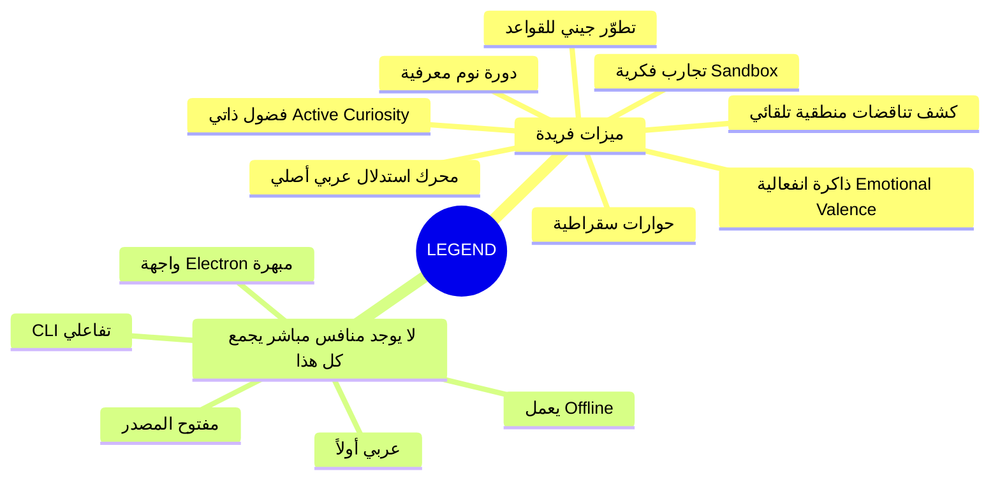

# 🪐 LEGEND v4 — مراجعة شاملة وتحليل استراتيجي

---

## 📊 نظرة عامة سريعة

| البُعد | القيمة |
|:---|:---|
| **حجم الكود** | ~10,373 سطر Python + React/Electron Frontend |
| **الملفات الجوهرية** | `neuro_symbolic_engine.py` (4,728 سطر)، `api.py` (1,361)، `cognitive_engine.py` (666)، `cli/engine.py` (1,342)، `cli/cli.py` (1,418) |
| **التقنيات** | Python, FastAPI, SQLite, NetworkX, React, Electron, llama.cpp |
| **اللغات المدعومة** | 11 لغة (عربي، إنجليزي، فرنسي، إسباني، صيني، تركي، ألماني، روسي، برتغالي، ياباني، كوري) |
| **مزودو الذكاء الاصطناعي** | Google Gemini, Groq, OpenRouter, Local GGUF Models |

---

## 🏗️ الجزء الأول: ما الذي يمكن تحسينه؟

### 🔴 مشاكل هيكلية حرجة

#### 1. تكرار الكود (Code Duplication) — مشكلة جوهرية
أكبر مشكلة في المشروع هي **التكرار الضخم** بين الملفات:
- `neuro_symbolic_engine.py` (4,728 سطر) و `cli/engine.py` (1,342 سطر) يحتويان على **نفس الكلاسات والدوال تقريباً** مكررة بالكامل
- `normalize_arabic()` موجودة **3 مرات** بتطبيقات مختلفة قليلاً
- `call_llm_api()` مكررة بين الملفين
- `ArabicReasoningEngine` و `ArabicNeuroSymbolicPrototype` نفس الكلاس بأسماء مختلفة

```diff
- # الوضع الحالي: 3 نسخ من normalize_arabic
- neuro_symbolic_engine.py → normalize_arabic (سطر 10)
- cli/engine.py → normalize_arabic (سطر 43)
- cognitive_engine.py → normalize_arabic (سطر 22)
+ # الحل: ملف واحد مشترك
+ core/arabic_utils.py → normalize_arabic()
+ core/llm_client.py → call_llm_api()
+ core/reasoning_engine.py → ArabicReasoningEngine
```

> [!WARNING]
> هذا التكرار يعني أن أي إصلاح لبغ أو تحسين يجب تطبيقه في **3 أماكن مختلفة**. هذا يصعّب الصيانة ويزيد احتمال الأخطاء.

#### 2. إدارة اتصالات SQLite (Connection Management)
```python
# الوضع الحالي: فتح/إغلاق اتصال جديد في كل عملية
conn = sqlite3.connect(self.db_path)
cursor = conn.cursor()
# ... عملية واحدة
conn.commit()
conn.close()
```
**المشكلة**: كل عملية كتابة تفتح وتغلق اتصالاً جديداً — مكلف جداً عند الاستيعاب المكثف.

**الحل**: استخدام Connection Pool أو Context Manager موحّد:
```python
from contextlib import contextmanager

@contextmanager
def get_db(self):
    conn = sqlite3.connect(self.db_path)
    try:
        yield conn
        conn.commit()
    finally:
        conn.close()
```

#### 3. غياب الاختبارات الشاملة (Testing)
- الملف `run_tests.py` موجود لكنه بسيط جداً (2,047 بايت فقط)
- لا يوجد اختبارات وحدة للمحرك الدلالي أو نظام التناقضات أو الاستدلال

#### 4. إدارة التوابع (Dependencies)
- لا يوجد `requirements.txt` أو `pyproject.toml` في الجذر
- التعامل مع المكتبات الاختيارية عبر `try/except ImportError` في كل مكان بدلاً من نظام مركزي

---

### 🟡 تحسينات متوسطة الأهمية

#### 5. محدودية نموذج الرسم البياني (Single-Edge Graph)
```python
self.graph = nx.DiGraph()  # يسمح بحافة واحدة فقط بين عقدتين
```
`DiGraph` يسمح بعلاقة **واحدة فقط** بين أي عقدتين. مثلاً: لا يمكن تخزين:
- "أحمد" ➔ يعمل_في ➔ "الرياض"
- "أحمد" ➔ ولد_في ➔ "الرياض"

**الحل**: الانتقال إلى `nx.MultiDiGraph()` لدعم علاقات متعددة بين نفس العقدتين.

#### 6. عدم وجود Embedding/Vector Search
النظام يعتمد على **مطابقة نصية حرفية** لاسترجاع الحقائق:
```python
# الطريقة الحالية: بحث بالكلمات المفتاحية فقط
for word in words:
    if len(word) > 2:
        word_variants = strip_arabic_affixes(word)
        for wv in word_variants:
            for nv in node_variants:
                if wv in nv or nv in wv:
                    matched_nodes.add(node)
```
إضافة **Vector Embeddings** (مثل `sentence-transformers` مع نموذج عربي) سيحسّن دقة الاسترجاع بشكل كبير.

#### 7. حدودية Scalability مع SQLite
SQLite جيد للنماذج الأولية، لكنه يصبح عنق زجاجة مع:
- أونتولوجيا تحتوي أكثر من 100,000 عقدة
- وصول متزامن من عدة مستخدمين

**بديل مستقبلي**: PostgreSQL + pgvector أو Neo4j لقواعد بيانات رسوم بيانية حقيقية.

#### 8. أمان API
```python
app.add_middleware(CORSMiddleware, allow_origins=["*"])  # فتح لكل المصادر
```
- لا يوجد أي نظام مصادقة (Authentication) على الـ API
- مفاتيح LLM ترسل في body كل طلب بدون تشفير

---

### 🟢 تحسينات تجميلية

| التحسين | التفاصيل |
|:---|:---|
| **Type Hints** | `neuro_symbolic_engine.py` يفتقر لـ Type Hints (الملف الرئيسي 4,728 سطر) بينما `cli/engine.py` يملكها |
| **Logging** | استخدام `print()` في كل مكان بدلاً من `logging` module |
| **Error Handling** | كثير من `except Exception: pass` تبتلع الأخطاء بصمت |
| **Docstrings** | غير متسقة — بعضها بالعربي وبعضها بالإنجليزي |
| **Constants** | أرقام سحرية مثل `0.95`, `0.38`, `0.65` مبعثرة دون ثوابت واضحة |

---

## 💡 الجزء الثاني: أفكار ومقترحات

### 🎯 أفكار من داخل الصندوق (تحسينات مباشرة)

#### 1. 🔄 نظام الإصدارات الزمنية (Temporal Versioning)
البنية الحالية تدعم `valid_from` و `valid_to` لكنها لا تُستخدم فعلياً في الاستدلال. فكرة التحسين:
- عند الاستعلام، فلترة الحقائق حسب النقطة الزمنية
- **سيناريو**: "أين عمل أحمد في 2020؟" vs "أين يعمل أحمد الآن؟"
- إضافة **Timeline View** في الواجهة لعرض تطور المعرفة زمنياً

#### 2. 📤 تصدير/استيراد بصيغ قياسية
- **RDF/OWL Export**: تصدير الأونتولوجيا بصيغة RDF لتوافقها مع أدوات الويب الدلالي العالمية
- **JSON-LD**: للتكامل مع محركات البحث وSchema.org
- **SPARQL Endpoint**: واجهة استعلام قياسية عالمية

#### 3. 🌐 ربط بـ Wikidata/DBpedia
- ربط المفاهيم المحلية بمعرّفات Wikidata تلقائياً
- إثراء الأونتولوجيا بمعلومات إضافية من مصادر خارجية
- **مثال**: عند إدخال "القاهرة"، يقترح النظام ربطها بـ `Q85` في Wikidata

#### 4. 🔐 نظام أدوار وصلاحيات
- **Admin**: تعديل القواعد المنطقية وحذف المفاهيم
- **Editor**: إضافة حقائق جديدة
- **Viewer**: استعلام فقط
- مهم جداً للاستخدام المؤسسي

#### 5. 📊 لوحة تحليلات متقدمة (Analytics Dashboard)
- رسم بياني لنمو المعرفة عبر الزمن
- خريطة حرارية لأكثر المفاهيم استخداماً
- تقرير جودة المعرفة (نسبة المفاهيم الضعيفة vs القوية)

---

### 🚀 أفكار من خارج الصندوق (ابتكارات)

#### 6. 🧠 ذاكرة محادثة مستمرة (Persistent Conversational Memory)
تحويل LEGEND إلى **ذاكرة طويلة المدى لبوتات المحادثة**:
- كل محادثة يستخرج منها حقائق وتُخزّن في الأونتولوجيا
- عند محادثة لاحقة، يسترجع البوت الحقائق السابقة
- **مثال**: بوت خدمة عملاء يتذكر أن العميل اشتكى من مشكلة معينة في المحادثة السابقة

#### 7. 🎓 نظام تعليمي تكيّفي (Adaptive Learning System)
- بناء أونتولوجيا للمنهج الدراسي
- تتبع فهم الطالب كـ "عقد معرفية" مع درجات ثقة
- إذا كانت ثقة الطالب بمفهوم "المعادلة التربيعية" = 0.3، يقترح النظام مراجعة "حل المعادلات الخطية" أولاً (لأنها prerequisite)

#### 8. 🏥 مساعد تشخيص طبي (Medical Diagnostic Assistant)
- أونتولوجيا طبية عربية: أعراض ➔ أمراض ➔ علاجات
- الاستدلال المتعدي: "ألم في الصدر" + "ضيق تنفس" ➔ احتمال "مشكلة قلبية"
- **ميزة LEGEND الفريدة**: تتبع الثقة وكشف التناقضات (لن يقبل تصنيف مريض كـ"سليم" و"مريض" في نفس الوقت)

#### 9. ⚖️ محرك استنتاج قانوني (Legal Reasoning Engine)
- تحويل المواد القانونية العربية إلى أونتولوجيا
- الاستدلال: "إذا كان العقد يتضمن شرط X" + "تحقق الشرط X" ➔ "ينطبق الحكم Y"
- **فائدة عملية**: مساعدة المحامين في إيجاد سوابق قضائية مرتبطة منطقياً

#### 10. 🌍 ذكاء جيوسياسي (Geopolitical Intelligence)
- تخزين العلاقات بين الدول والمنظمات والأشخاص
- الاستدلال: "الدولة A حليفة الدولة B" + "الدولة B عدوة الدولة C" ➔ "توتر محتمل بين A و C"
- مع البعد الزمني: تتبع تطور العلاقات الدولية

#### 11. 🔮 نظام التنبؤ بالتأثيرات (Impact Prediction System)
استخدام سلاسل السببية الموجودة (`يؤدي_إلى`) لبناء:
- "ماذا سيحدث إذا...؟" — التنبؤ بتأثيرات متسلسلة
- **مثال بيئي**: "إذا انقرض النمر" ➔ "تكاثر الغزلان" ➔ "تدمير الغطاء النباتي" ➔ "تصحر"
- **مثال اقتصادي**: "إذا ارتفع سعر النفط" ➔ سلسلة تأثيرات اقتصادية

#### 12. 🏢 إدارة المعرفة المؤسسية (Enterprise Knowledge Management)
تحويل LEGEND إلى **نظام إدارة معرفة مؤسسية**:
- كل موظف يضيف خبراته كحقائق وقواعد
- عند مغادرة موظف، تبقى معرفته محفوظة في النظام
- النظام يستدل ويجيب عن أسئلة مثل "من المسؤول عن هذه العملية؟" أو "ما هي الخطوات لحل مشكلة X؟"

---

## 📋 الجزء الثالث: جدوى المشروع وحالات الاستخدام

> [!IMPORTANT]
> LEGEND **ليس مشروعاً بحثياً فقط**. لديه إمكانية تجارية حقيقية لأنه يحل مشكلة واقعية: **هلوسة نماذج الذكاء الاصطناعي** في السياق العربي. الشركات الكبرى (Stardog, TigerGraph, Graphwise) تبيع حلولاً مشابهة بملايين الدولارات.

### حالات الاستخدام العملية

| # | حالة الاستخدام | القطاع | كيف يخدم LEGEND | مثال عملي |
|:--|:---|:---|:---|:---|
| 1 | **بوت خدمة عملاء ذكي** | اتصالات، بنوك | يمنع البوت من إعطاء معلومات خاطئة عن المنتجات والخدمات | بنك يربط المنتجات والشروط في أونتولوجيا، البوت يجيب بدقة 100% |
| 2 | **نظام فتاوى إسلامية** | ديني، تعليمي | أونتولوجيا فقهية مع قواعد أصول الفقه كقواعد منطقية | "هل يجوز X؟" — يستدل من القواعد والأدلة المخزنة |
| 3 | **تحليل نصوص تراثية** | أكاديمي، ثقافي | استخراج المعارف من كتب التراث العربي وربطها دلالياً | تحويل "مقدمة ابن خلدون" إلى شبكة معرفية مترابطة |
| 4 | **إدارة السلامة الصناعية** | نفط وغاز، صناعة | تخزين قواعد السلامة كقواعد منطقية والاستدلال بالتأثيرات | "إذا فشل صمام X" ➔ "يجب إغلاق خط Y" ➔ "إخلاء منطقة Z" |
| 5 | **مساعد أبحاث علمية** | جامعات | ربط الأوراق البحثية والنتائج في شبكة معرفية | "ما العلاقة بين البروتين X وال مرض Y؟" — يتتبع سلسلة الأدلة |
| 6 | **نظام توصيات تعليمية** | EdTech | تتبع معرفة الطالب واقتراح المحتوى بناءً على الثغرات | "الطالب يفهم الجبر لكن ضعيف في الهندسة" ➔ اقتراح دروس محددة |
| 7 | **تحليل المخاطر المالية** | بنوك، تأمين | سلاسل سببية للمخاطر مع درجات ثقة | "تعثر شركة A" ➔ "تأثر بنك B" ➔ "خطر على محفظة C" (ثقة 73%) |
| 8 | **مساعد قانوني عربي** | قانوني | ربط المواد القانونية والسوابق القضائية | "في قضية مشابهة حُكم بـ..." مع سلسلة الاستدلال |
| 9 | **نظام مراقبة أخبار** | إعلام، حكومات | استخراج الكيانات والعلاقات من الأخبار وتتبع التطورات | "وزير X زار دولة Y" ➔ تحديث شبكة العلاقات الدبلوماسية |
| 10 | **منصة Compliance** | مصرفي، حكومي | تحويل اللوائح إلى قواعد منطقية والتحقق من الالتزام | "هل المعاملة X تتوافق مع لائحة Y؟" — استدلال تلقائي |

---

## 🔬 الجزء الرابع: المشاريع والمنتجات المشابهة

### 🏢 منتجات تجارية مشابهة (Enterprise)

| المنتج | الشركة | السعر | ما يميّزه عن LEGEND | ما يميّز LEGEND عنه |
|:---|:---|:---|:---|:---|
| **Stardog Voicebox** | Stardog | Enterprise ($$$$) | "Safety RAG" مع عدم الهلوسة، دعم RDF/SPARQL | LEGEND يدعم العربية أصلاً ويعمل محلياً (Offline) |
| **TigerGraph KG-LLM** | TigerGraph | Enterprise ($$$$) | Scalability هائلة، Multi-hop reasoning بأداء عالي | LEGEND مفتوح المصدر ومجاني، واجهة ثرية |
| **PoolParty/Graphwise** | Graphwise | Enterprise ($$$) | تستخدمه NASA وMicrosoft وSiemens | LEGEND يحتوي على محرك عاطفي (Emotional Valence) وتجارب فكرية |
| **Memgraph 3.0** | Memgraph | Community + Enterprise | GraphRAG + Vector Search أصلي | LEGEND يدعم 11 لغة وله CLI تفاعلي |
| **Neo4j + GraphRAG** | Neo4j | Community + Enterprise | أكبر قاعدة بيانات رسومية في العالم | LEGEND متخصص في العربية ويحتوي على محرك استدلال عربي |

### 🎓 مشاريع بحثية/أكاديمية مشابهة

| المشروع | الجهة | التشابه مع LEGEND | الفرق |
|:---|:---|:---|:---|
| **Arabic Ontology** (Birzeit) | جامعة بيرزيت | أونتولوجيا عربية رسمية | مبني يدوياً بالكامل، لا يوجد محرك LLM لاستخراج المعرفة تلقائياً |
| **OntologyRAG-Q** | بحث أكاديمي 2025 | RAG مبني على أونتولوجيا للتفسير القرآني | متخصص في مجال واحد فقط، LEGEND عام |
| **CAMeL Tools** | NYU Abu Dhabi | معالجة لغة عربية | أدوات NLP فقط، لا يوجد محرك استدلال أو knowledge graph |
| **SinaTools** | جامعة بيرزيت | NER + Relation Extraction | أدوات استخراج فقط بدون تخزين أو استدلال |
| **mRAKL** | ACL 2025 | بناء KG متعدد اللغات | يركز على Cross-lingual transfer، LEGEND يركز على الاستدلال |

### 🌟 ما يجعل LEGEND فريداً



---

## 🎯 الجزء الخامس: خارطة طريق مقترحة

### المرحلة 1: تثبيت الأساسات (1-2 شهر)
- [ ] توحيد الكود وحذف التكرار (إنشاء `core/` module مشترك)
- [ ] الانتقال إلى `MultiDiGraph` لدعم علاقات متعددة
- [ ] إضافة `requirements.txt` و Docker Compose
- [ ] كتابة اختبارات وحدة شاملة
- [ ] تحسين إدارة اتصالات SQLite

### المرحلة 2: تعزيز القدرات (2-3 أشهر)
- [ ] إضافة Vector Embeddings للبحث الدلالي
- [ ] تصدير RDF/OWL و JSON-LD
- [ ] ربط بـ Wikidata API
- [ ] نظام مصادقة وأدوار
- [ ] لوحة تحليلات

### المرحلة 3: التموضع التجاري (3-6 أشهر)
- [ ] REST API مستقل كـ SaaS
- [ ] SDK لـ Python و JavaScript
- [ ] توثيق API شامل
- [ ] نموذج أولي لقطاع محدد (مثل: بوتات خدمة عملاء عربية)

---

## 🏆 الخلاصة

> [!TIP]
> **LEGEND مشروع واعد جداً** وليس بحثياً فقط. السوق يحتاج بشدة لنظام Knowledge Graph عربي مفتوح المصدر مع محرك استدلال. المنافسون التجاريون يبيعون حلولاً أضعف بملايين الدولارات. التحدي الأساسي هو: **تنظيف الكود وبناء SDK مستقل قابل للتكامل** ليصبح مكتبة يستخدمها المطورون العرب في مشاريعهم.

**النقطة الأهم**: لا يوجد في السوق العربي حالياً **أي منتج** يجمع بين:
1. استخراج المعرفة بالذكاء الاصطناعي تلقائياً
2. تخزينها في Knowledge Graph
3. الاستدلال المنطقي عليها
4. كشف التناقضات
5. العمل بدون إنترنت

هذا يعني أن LEGEND يمكن أن يصبح **"Neo4j العربي"** إذا تم التعامل معه كمنتج وليس كمشروع شخصي فقط.
